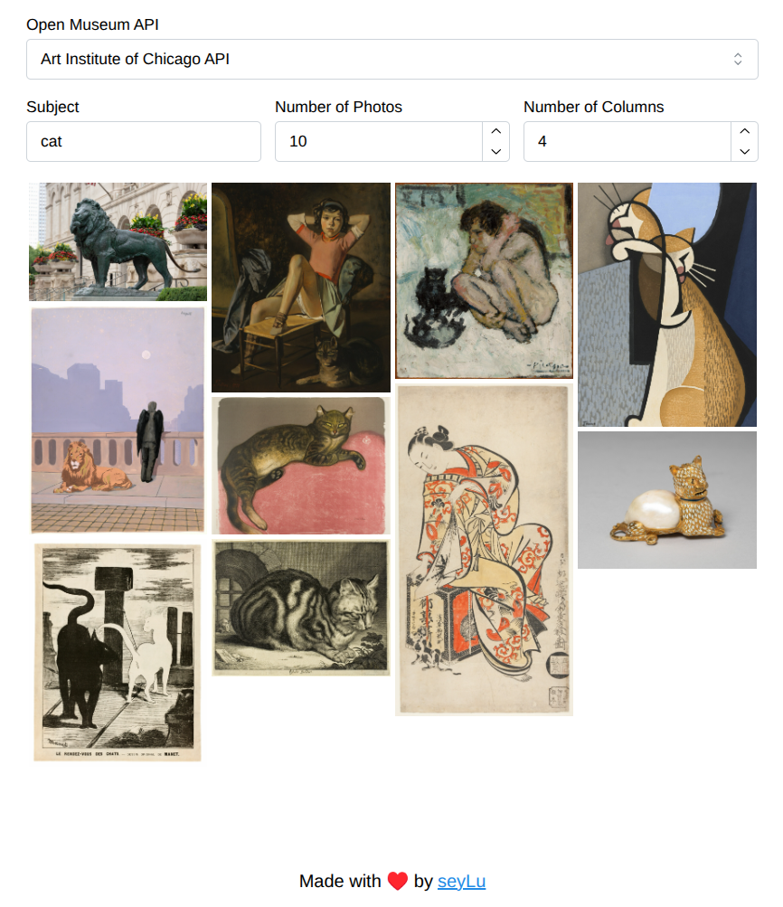

<div align="center">
    
    <h1>Curator</h1>
    <p>A masonry gallery viewer for open museum APIs.</p>
    <p>
        <a href="https://www.typescriptlang.org/"></img></a>
        <a href="https://react.dev/"></img></a>
        <a href="https://vite.dev/"></img></a>
        <a href="https://tailwindcss.com/"></img></a>
        <a href="https://mantine.dev/"></img></a>
    </p>
    <p>
        <a href="https://github.com/seyLu/curator/issues/new">Report Bug</a>
        ·
        <a href="https://github.com/seyLu/curator/issues/new">Request Feature</a>
        ·
        <a href="https://github.com/seyLu/curator/discussions">Ask Question</a>
    </p>
</div>

<br>

### Supported Open Museum APIs:

- [Art Institute of Chicago](https://api.artic.edu/docs/)
- [The Metropolitan Museum of Art Collection](https://metmuseum.github.io/)
- [The Cleveland Museum of Art Open Access](https://openaccess-api.clevelandart.org/)



[See demo on Github Pages](https://seylu.github.io/curator)

<br>

### Developing Locally

#### Install dependencies

```bash
npm i -D
```

#### Run server & watch for changes

```bash
npm run dev
```

<br>

### Adding a new Open Museum API

#### 1. Implement an image fetcher that satifies `ImageFetcher` interface
```ts
// src/services/imageFetcher.ts

export interface Image {
  id: string;
  url: string;
  alt: string;
}

export interface ImageFetcher {
  fetchImages(query: string, count: number): AsyncGenerator<Image, void, unknown>;
}
```

The image fetcher must:

- Define an async `*fetchImages()` generator.

- Yield Image objects containing `id`, `url`, and `alt`.

```ts
// src/lib/api/<api>.ts

export const ArticFetcher: ImageFetcher = {
  async *fetchImages(
    query: string,
    count: number,
  ): AsyncGenerator<Image, void, unknown> {
      ...
      yield {
        id: <image_id>,
        url: <image_url>,
        alt: <image_alt>,
      };
}
```

##### 2. Add it to the available museum options

```ts
// src/lib/index.ts

export interface OpenMuseumApi {
  fetcher: ImageFetcher;
  value: string;
  label: string;
}

export const museumOptions: Record<string, OpenMuseumApi> = {
  artic: {
    fetcher: ArticFetcher,
    value: "artic",
    label: "Art Institute of Chicago",
  },
  ...
}
```
